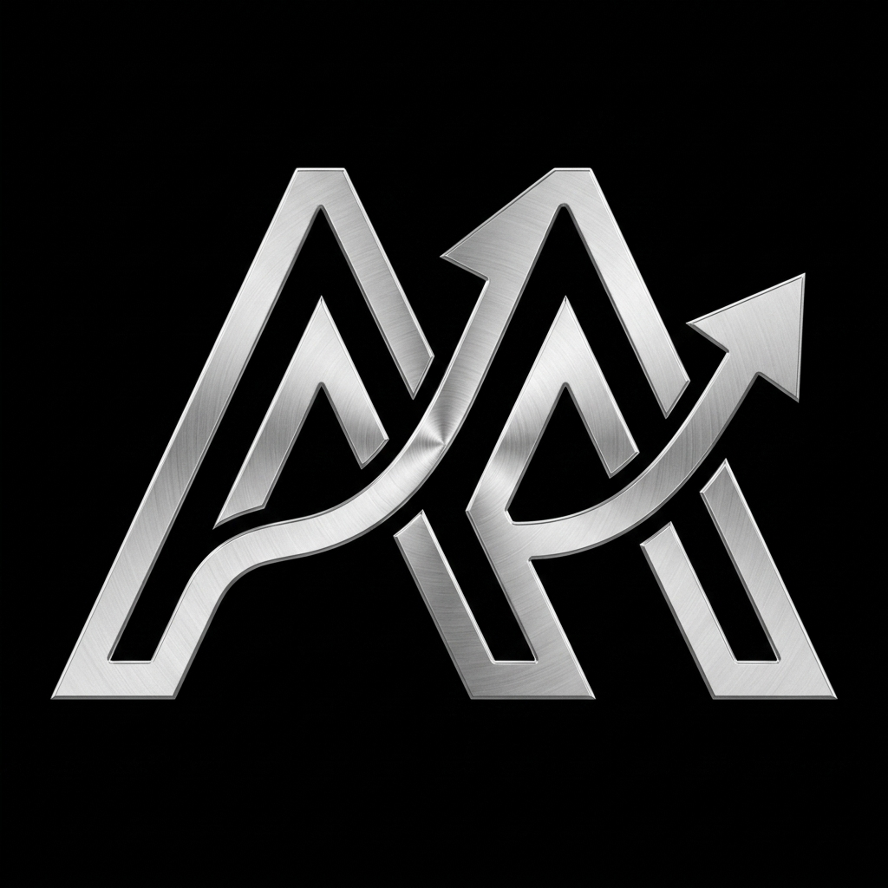
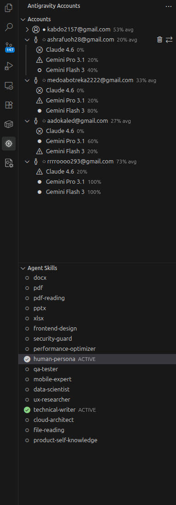

# Agent Assistant
### The Definitive AI Expert Persona & Quota Management Suite

  

  
  
  

---

[English](#the-vision) | [العربية](#الرؤية)

## The Vision
Agent Assistant is an elite orchestration layer for AI-native software engineering. It bridges the gap between general-purpose models and domain-specific excellence by injecting professional constraints, technical workflows, and expert personas directly into the agent's cognition.

## Key Capabilities

### Expert Persona Injection
*   Domain Expertise: Instantly elevate your agent's performance in fields like Security, UI/UX, and QA.
*   Universal Context: Works seamlessly with Claude, GPT, Gemini, and Llama using official Anthropic Skill Specs.
*   Deep Memory Sync: Automatically generates .antigravity/ context files that agents discover and prioritize.

### Professional Resource Mastery
*   Precision Quota Sync: Real-time balance monitoring for multi-account environments.
*   Account Rotation Engine: Securely switch sessions without breaking your development flow.
*   Glassmorphism Dashboard: A premium, high-visibility UI designed for professional focus.

## Expert Skill Library

| Role | Expertise | Core Technologies |
| :--- | :--- | :--- |
| Security Guard | Vulnerability Auditing | OWASP, Secret Protection, .env Safety |
| UI Architect | Modern Web Design | Tailwind CSS, Framer Motion, A11y |
| Performance | Code Efficiency | Big O Analysis, Memory Management |
| Human Coder | Senior Persona | No AI Artifacts, Pragmatic, Professional |
| QA Specialist | Quality Assurance | Playwright, Jest, Vitest, E2E Testing |
| Mobile Lead | Cross-Platform Engineering | Flutter, React Native, Native UI |

## Setup Guide

1.  Deploy: Install the official .vsix from Releases.
2.  Activate: Access the Agent Assistant icon in the sidebar.
3.  Optimize: Enable the expert skills your current project demands.
4.  Confirm: Ask your agent: "Show me your active skills and expert instructions."

---

<h2 id="الرؤية" dir="rtl">الرؤية</h2>

Agent Assistant هو نظام إدارة متكامل لمستقبل البرمجة المعتمدة على الذكاء الاصطناعي. يقوم النظام بتحويل النماذج العامة إلى خبراء متخصصين عبر حقن تعليمات تقنية وقيود مهنية دقيقة في ذاكرة الأيجنت، مما يضمن نتائج بمستوى كبار المهندسين.

<h2 dir="rtl">الإمكانيات الجوهرية</h2>

<ul dir="rtl">
  <li>حقن الخبرات الخبيرة: تحويل شخصية الأيجنت إلى خبير حماية، مهندس واجهات، أو مدقق جودة في ثوانٍ.</li>
  <li>توافقية عالمية: يدعم كافة النماذج الرائدة (GPT-4, Claude 3.5, Gemini) عبر بروتوكولات Anthropic الرسمية.</li>
  <li>إدارة الحصص المتقدمة: مزامنة فورية ومراقبة دقيقة للأرصدة عبر واجهة زجاجية عصرية وفائقة السرعة.</li>
</ul>

---
*Created with precision by men3em*
