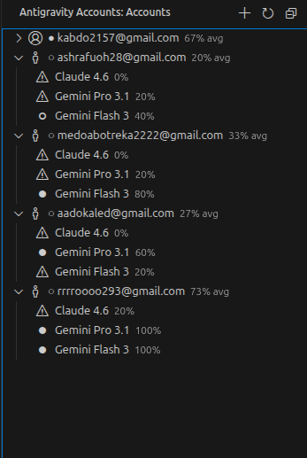

# Antigravity Accounts

  
  

  

[English](#overview) | [العربية](#نظرة-عامة)

## Overview

Antigravity Accounts is a specialized management extension for the Antigravity desktop application. It optimizes professional workflows by providing seamless multi-account synchronization and resource monitoring directly within the VS Code environment.

## Core Features

- Multi-Account Management: Securely organize and maintain multiple authenticated Google sessions.
- Instant Session Injection: Synchronize account states with the Antigravity database via a unified interface.
- Quota Monitoring: Real-time visibility into credit balances across supported models.
- Data Portability: Encrypted export and import protocols for secure workspace migration.
- Localized Experience: Native support for English and Arabic interface configurations.

## Requirements

- Antigravity Desktop: Version 1.23.2 or newer.
- Environment Initialization: A primary login via the desktop application is required to establish the local database.

## Usage

1. Access the **Antigravity Accounts** module from the VS Code Activity Bar.
2. Utilize the **Add Account** function to initiate secure authentication.
3. Select **Activate** on the target account to update the global session. The editor will perform a standard reload to apply configuration changes.

## Technical Support

For technical inquiries or issue reporting:
- [Issue Tracker](https://github.com/men3emkhaledkhaled/antigravity-accounts-extension/issues)
- [Repository](https://github.com/men3emkhaledkhaled/antigravity-accounts-extension)
- [Author](https://github.com/men3emkhaled)

---

<h2 id="نظرة-عامة" dir="rtl">نظرة عامة</h2>

إضافة متخصصة لإدارة بيئة عمل Antigravity، تهدف إلى رفع كفاءة الأداء المهني عبر مزامنة الحسابات المتعددة ومراقبة الموارد مباشرة من داخل VS Code.

<h2 dir="rtl">المميزات الأساسية</h2>

<ul dir="rtl">
  <li><strong>إدارة مركزية</strong>: تنظيم وحفظ جلسات المصادقة المتعددة بشكل آمن ومستقر.</li>
  <li><strong>مزامنة فورية</strong>: حقن بيانات الجلسة في قاعدة بيانات Antigravity بضغطة واحدة.</li>
  <li><strong>متابعة الحصص</strong>: مراقبة دقيقة للأرصدة المتاحة لمختلف النماذج البرمجية.</li>
  <li><strong>نقل البيانات</strong>: بروتوكولات تصدير واستيراد مشفرة لضمان أمن البيانات عند التنقل بين الأجهزة.</li>
  <li><strong>تجربة محلية</strong>: دعم كامل لواجهة المستخدم باللغتين العربية والإنجليزية.</li>
</ul>

<h2 dir="rtl">المتطلبات</h2>

<ul dir="rtl">
  <li>تطبيق Antigravity المكتبي (إصدار 1.23.2 فأحدث).</li>
  <li>تهيئة البيئة: يتطلب تسجيل الدخول لأول مرة عبر التطبيق المكتبي لإنشاء قاعدة البيانات المحلية.</li>
</ul>

<h2 dir="rtl">دليل الاستخدام</h2>

<ol dir="rtl">
  <li>افتح وحدة <strong>Antigravity Accounts</strong> من شريط الأدوات الجانبي.</li>
  <li>استخدم وظيفة <strong>إضافة حساب</strong> لبدء عملية المصادقة الآمنة.</li>
  <li>اضغط على <strong>تنشيط</strong> للحساب المطلوب لتحديث الجلسة؛ سيقوم المحرر بإعادة تحميل تلقائية لتطبيق الإعدادات الجديدة.</li>
</ol>

<h2 dir="rtl">الدعم الفني</h2>

<ul dir="rtl">
  <li><a href="https://github.com/men3emkhaledkhaled/antigravity-accounts-extension/issues">مركز البلاغات</a></li>
  <li><a href="https://github.com/men3emkhaledkhaled/antigravity-accounts-extension">المستودع البرمجي</a></li>
  <li><a href="https://github.com/men3emkhaled">المطور</a></li>
</ul>
