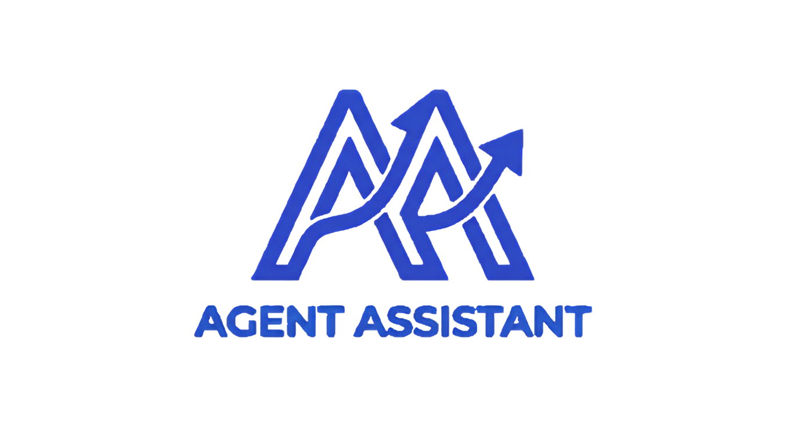

# Agent Assistant
### AI Expert Persona & Quota Management for VS Code

<p align="center">
  
</p>


<p align="center">
  <a href="https://github.com/men3emkhaled/agent-assistant-extension"></a>
  <a href="https://github.com/men3emkhaled/agent-assistant-extension/releases"></a>
  <a href="https://github.com/men3emkhaled/agent-assistant-extension/issues"></a>
</p>

---

[English](#overview) | [العربية](#نظرة-عامة)

## Overview

Agent Assistant is a VS Code extension with two core functions:

**Account Management** — manage multiple Antigravity accounts from the VS Code sidebar. See real-time balances and switch between accounts with one click, without leaving your editor.

**Expert Skills** — give your AI agent a specialized role by enabling skills from the sidebar. The extension writes the instructions into every file the agent reads automatically, so the persona persists across the entire session — not just the first message.

---

## How Skill Injection Works

When you enable a skill, the extension writes the instructions to all agent instruction files simultaneously:

| File | Agent |
| :--- | :--- |
| `GEMINI.md` | Antigravity IDE |
| `CLAUDE.md` | Claude Code |
| `.cursorrules` | Cursor |
| `.github/copilot-instructions.md` | GitHub Copilot / Gemini |
| `.vscode/settings.json` | VS Code built-in chat |
| `.gemini/settings.json` | Gemini Code Assist |

The instructions include a persistent header that explicitly tells the agent to apply the guidelines for **every message in the session**, not just the first.

On extension activation, previously enabled skills are automatically re-injected — no manual re-enabling required.

---

## Expert Skill Library (30+ Skills)

### Development & Code Quality
| Skill | Description |
| :--- | :--- |
| `refactor-pro` | SOLID principles, design patterns, code smells elimination |
| `debug-expert` | Scientific debugging, root cause analysis, systematic isolation |
| `code-reviewer` | PR review prioritization, security checks, constructive feedback |
| `performance-optimizer` | Big O analysis, profiling, memory leak detection, Web Workers |
| `security-guard` | OWASP top 10, secret management, dependency auditing |
| `qa-tester` | Testing pyramid, AAA pattern, contract tests, visual regression |
| `git-expert` | Conventional commits, rebase workflows, atomic commits |
| `sql-expert` | Query optimization, indexing strategy, execution plan analysis |
| `regex-master` | Named groups, backtracking prevention, flag selection |
| `api-tester` | Status code coverage, schema validation, idempotency testing |
| `prompt-engineer` | Role definition, chain-of-thought, few-shot examples |

### Design & CSS
| Skill | Description |
| :--- | :--- |
| `frontend-design` | Component architecture, design tokens, fluid typography, skeleton screens |
| `css-master` | Cascade layers, container queries, `@property`, subgrid, logical properties |
| `animation-expert` | Spring physics, FLIP technique, View Transitions API, `prefers-reduced-motion` |
| `design-system` | Token tiers, Style Dictionary, Storybook, visual regression CI |
| `color-theory` | HSL palettes, oklch(), WCAG contrast, dark mode design, 60-30-10 rule |
| `creative-ui` | Glassmorphism, Bento Grid, scroll-driven animations, gradient mesh |
| `ux-researcher` | Fitts's Law, Hick's Law, WCAG 2.1 AA, F-pattern, error state design |

### Infrastructure & Systems
| Skill | Description |
| :--- | :--- |
| `cloud-architect` | GitOps, blue-green deployments, RED monitoring, Terraform, multi-stage Docker |
| `backend-architect` | CQRS, idempotency, cursor pagination, repository pattern, correlation IDs |
| `mlops-expert` | Feature stores, drift detection, shadow mode, pipeline DAGs |
| `embedded-expert` | MISRA-C, ISR design, watchdog timers, static allocation |
| `mobile-expert` | Thumb-zone design, 60fps targeting, safe area insets, offline sync |

### Productivity & Communication
| Skill | Description |
| :--- | :--- |
| `human-persona` | Eliminates AI markers and emojis, senior developer tone |
| `technical-writer` | ADRs, runbooks, co-located docs, OpenAPI 3.1 |
| `docx` | Heading hierarchy, styles, cross-references, TOC |
| `pdf` / `pdf-reading` | OCR detection, proper redaction, structure-aware extraction |
| `pptx` | 6x6 rule, narrative arc, slide masters |
| `xlsx` | INDEX-MATCH, Power Query, named ranges, data validation |
| `data-scientist` | EDA, SHAP explainability, DVC versioning |
| `web3-expert` | CEI pattern, OpenZeppelin, gas optimization, fuzz tests |

---

## Installation

**From VS Code Marketplace:**
Search for **Agent Assistant** in the Extensions panel (`Ctrl+Shift+X`).

**Manual install:**
Download the latest `.vsix` from [Releases](https://github.com/men3emkhaled/agent-assistant-extension/releases) and run:
```
code --install-extension agent-assistant-x.x.x.vsix
```

---

## Quick Start

1. Open the **Agent Assistant** panel from the VS Code activity bar.
2. Add your Antigravity accounts under the **Accounts** section.
3. Enable the skills you need from the **Expert Skills** section.
4. Open a new chat with your AI agent — the personas are active from message one.

---

<h2 id="نظرة-عامة" dir="rtl">نظرة عامة</h2>

<p dir="rtl">
Agent Assistant هو extension لـ VS Code بيشتغل على جانبين:
</p>

<ul dir="rtl">
  <li><strong>إدارة الاكونتات</strong> — بيجمع كل حسابات Antigravity بتاعتك في مكان واحد جوه VS Code. بتشوف الـ balance لكل حساب في الوقت الفعلي وبتعمل switch بينهم بكليكة واحدة.</li>
  <li><strong>Expert Skills</strong> — بتفعّل skill من الـ sidebar وبيكتب الـ extension التعليمات في كل الملفات اللي الـ agent بيقرأها تلقائياً. الشخصية بتفضل فاكرها طول الشات مش بس أول رسالة.</li>
</ul>

<h3 dir="rtl">ازاي بيشتغل الـ Injection</h3>

<p dir="rtl">
لما تفعّل أي skill، الـ extension بيكتب التعليمات في كل الملفات دي في نفس الوقت:
</p>

<ul dir="rtl">
  <li><code>GEMINI.md</code> — لـ Antigravity IDE</li>
  <li><code>CLAUDE.md</code> — لـ Claude Code</li>
  <li><code>.cursorrules</code> — لـ Cursor</li>
  <li><code>.github/copilot-instructions.md</code> — لـ GitHub Copilot / Gemini</li>
  <li><code>.vscode/settings.json</code> — لـ VS Code chat</li>
</ul>

<p dir="rtl">
وعند فتح VS Code، الـ Skills اللي كانت مفعلة بترجع تتحقن تلقائياً من غير ما تعمل أي حاجة.
</p>

---

*Developed by [men3em](https://github.com/men3emkhaled)*
